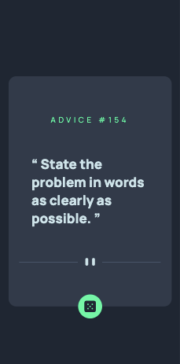
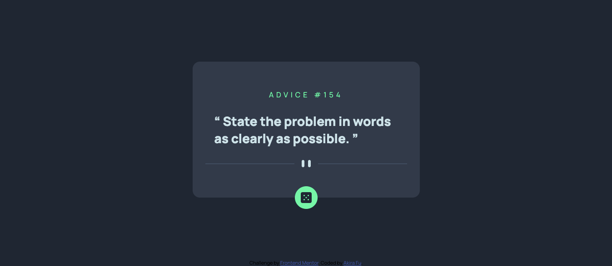

# Frontend Mentor - Advice generator app solution

This is a solution to the [Advice generator app challenge on Frontend Mentor](https://www.frontendmentor.io/challenges/advice-generator-app-QdUG-13db). Frontend Mentor challenges help you improve your coding skills by building realistic projects.

## Table of contents

-   [Overview](#overview)
    -   [The challenge](#the-challenge)
    -   [Screenshot](#screenshot)
    -   [Links](#links)
-   [My process](#my-process)
    -   [Built with](#built-with)
    -   [What I learned](#what-i-learned)
    -   [Continued development](#continued-development)
    -   [Useful resources](#useful-resources)
-   [Author](#author)
-   [Acknowledgments](#acknowledgments)

## Overview

### The challenge

Users should be able to:

-   View the optimal layout for the app depending on their device's screen size
-   See hover states for all interactive elements on the page
-   Generate a new piece of advice by clicking the dice icon

### Screenshot




### Links

-   Solution URL: [Add solution URL here](https://your-solution-url.com)
-   Live Site URL: [Add live site URL here](https://your-live-site-url.com)

## My process

### Built with

-   Semantic HTML5 markup
-   CSS custom properties
-   Flexbox
-   Mobile-first workflow
-   API
-   JavaSript

### What I learned

```css
.proud-of-this-css {
  .dice:hover {
    -webkit-box-shadow: 0px 0px 10px 2px var(--Neon-Green);
    box-shadow: 0px 0px 10px 2px var(--Neon-Green);
}

```

```js
const proudOfThisFunc = () => {
    dice.addEventListener("click", async function () {
        const res = await axios.get("https://api.adviceslip.com/advice");
        adviceId.innerHTML = res.data.slip.id;
        advice.innerHTML = res.data.slip.advice;
    });
};
```

### Continued development

none

### Useful resources

-   [The Web Developer Bootcamp 2022](https://udemy.com/course/the-web-developer-bootcamp)

## Author

-   Website - [akiraafu](https://github.com/akiraafu)
-   Frontend Mentor - [@akiraafu](https://www.frontendmentor.io/profile/akiraafu)
# advice-generator-app
